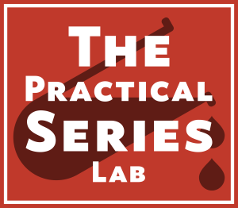

# A PracticalSeries Publication
 

    

 
The **Practical Series of publications** is a website resource for web developers and engineers. It contains a number of online publications designed to help and explain how to build a website, how to use version control and how to write engineering software for control systems.
 
## lab-brackets-git: How to use Brackets-Git
 
This is a demonstration (teaching) repository that explains how to manage a GitHub repository from within the Brackets text editor using the Brackets-Git extension.